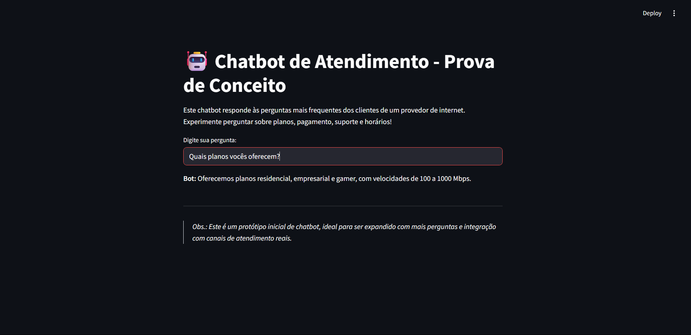
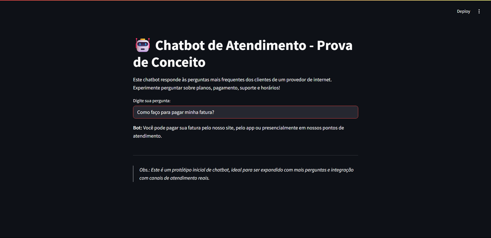
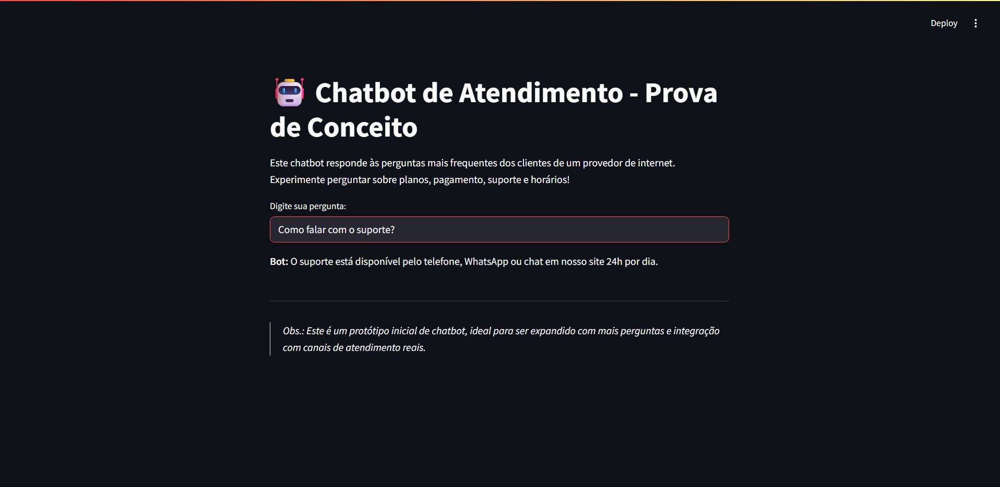

# 🤖 Chatbot de Atendimento – 

Um chatbot simples e funcional, desenvolvido em Python com [ChatterBot](https://chatterbot.readthedocs.io/) e [Streamlit](https://streamlit.io/), capaz de responder às perguntas mais frequentes dos clientes de um provedor de internet.  
Este projeto faz parte do meu portfólio como analista de inovação e demonstra aplicação de IA conversacional para melhorar a experiência do usuário.




---

## ✨ Funcionalidades

- Responde a perguntas frequentes sobre planos, faturas, suporte e horários.
- Interface interativa via navegador (Streamlit).
- Fácil de expandir com novas perguntas e respostas.
- Ideal para servir como base de POC para integração futura com WhatsApp, sites ou apps.

---

## 🚀 Demonstração

```bash
# Clone o repositório
git clone https://github.com/seu-usuario/chatbot-atendimento.git
cd chatbot-atendimento

# Crie e ative um ambiente virtual (recomendado)
python -m venv venv
# Windows:
venv\Scripts\activate
# Linux/macOS:
source venv/bin/activate

# Instale as dependências
pip install -r requirements.txt

# Baixe o modelo do Spacy necessário para o ChatterBot
python -m spacy download en_core_web_sm

# Execute a aplicação
streamlit run app/main.py
```
Acesse http://localhost:8501 no navegador para conversar com o bot!

## 🗂️ Estrutura do Projeto
```bash
chatbot-atendimento/
├── app/
│   └── main.py           # Código do bot e interface Streamlit
├── requirements.txt      # Dependências
├── imgs/                 # Prints/GIFs de demonstração
└── README.md
```

## 🛠️ Tecnologias Utilizadas

- Python 3.8+
- ChatterBot
- Streamlit
- SpaCy (para processamento de linguagem)
- (Opcional) Heroku/Streamlit Cloud para deploy gratuito

## 💡 Ideias de Expansão

- Adicionar mais FAQs ou integração com base de dados real
- Integração com WhatsApp (Twilio API) ou site corporativo
- Deploy na nuvem para uso público

## 📷 Screenshots



